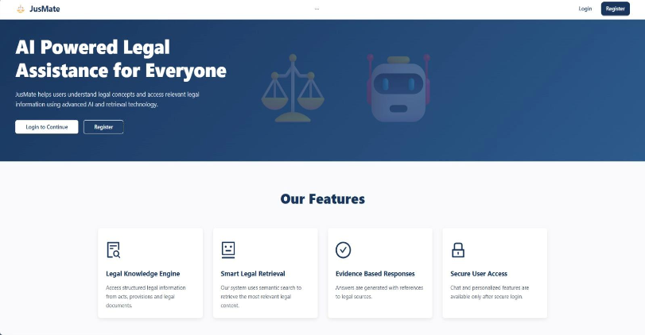
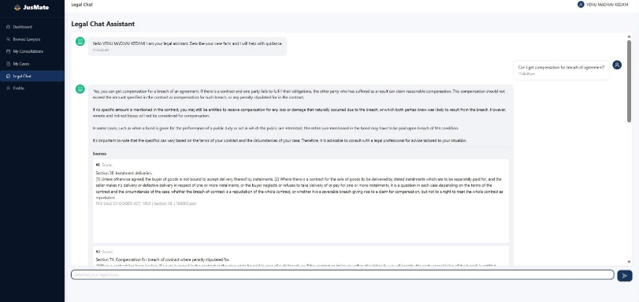
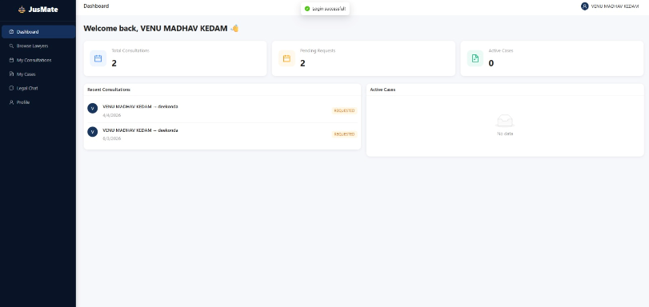
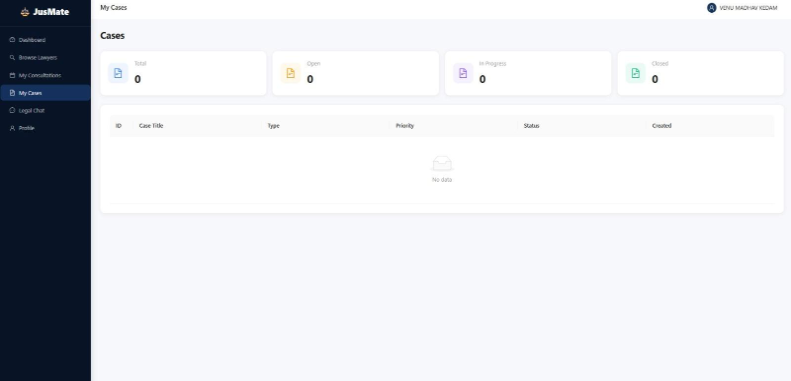
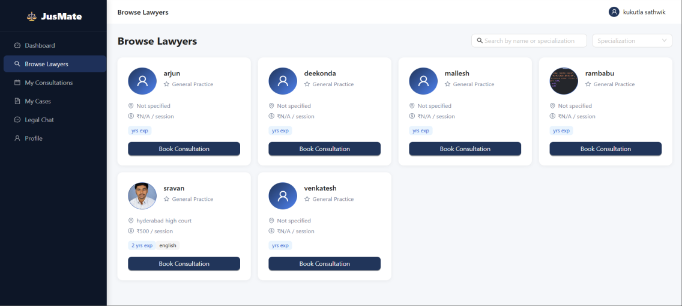
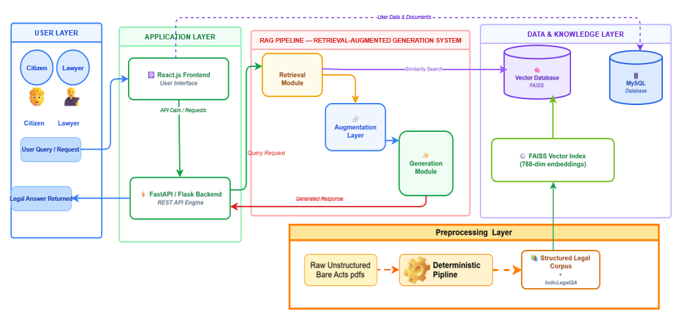

# JUSMATE

AI-powered legal intelligence platform using RAG, embeddings, NLP, and semantic search.


---

## Overview

JUSMATE is a legal-tech platform designed to help users retrieve and analyze legal information efficiently using Retrieval-Augmented Generation (RAG) and Large Language Models (LLMs).

The system combines semantic search, embeddings, and AI-powered retrieval to provide intelligent legal assistance and clause-level contextual responses.

---

## ✨ Features

- 🤖 **AI Legal Chat Assistant** — Ask legal questions and get clause-level, context-aware answers powered by RAG + LLM
- 🔍 **Semantic Search** — Embedding-based retrieval finds the most relevant legal documents for any query
- 👤 **Citizen Dashboard** — Manage consultations, track case history, and interact with the AI assistant
- 🧑‍⚖️ **Lawyer Dashboard** — Lawyers can manage their profile, view client requests, and handle consultations
- 🔎 **Lawyer Discovery** — Citizens can search and filter lawyers by specialization
- 🔐 **Authentication & Authorization** — Secure login flows for both citizens and lawyers
- 📊 **Evaluation Pipeline** — Built-in response quality evaluation for the RAG system

---

## 🖼️ Screenshots

### 🏠 Home Page


### 💬 AI Legal Chat Assistant


### 📋 Citizen Dashboard


### 🧑‍⚖️ Lawyer Dashboard


### 🔎 Lawyer Discovery


### 🏗️ System Architecture


---

## 🏗️ Architecture

JUSMATE follows a modular three-layer architecture:

```text
User Query (Frontend)
        ↓
Backend REST API (Node.js / Express)
        ↓
RAG Engine (Python)
├── Semantic Search via Embeddings
├── Legal Document Retrieval & Ranking
└── LLM Response Generation
        ↓
Response Returned to Frontend
```

---

### Flow
1. User submits a legal query via the React frontend.
2. Backend validates and routes the request.
3. RAG engine retrieves relevant legal clauses using embeddings.
4. Retrieved context is passed to the LLM to generate a grounded response.
5. Answer is returned to the user with source context.

---

## 🛠️ Tech Stack

| Layer | Technology |
|-------|------------|
| Frontend | React.js, TypeScript, Tailwind CSS, Vite |
| Backend | Node.js, Express.js |
| Database | MySQL |
| AI / ML | Python, RAG Pipeline, Embeddings, LLM Integration, NLP |

---

## 🗂️ Project Structure

```text
JUSMATE/
├── frontend/        # React + TypeScript frontend application
├── backend/         # Node.js + Express REST APIs and authentication
├── ragNllm/         # RAG pipeline, embeddings, retrieval, and LLM processing
├── screenshots/     # Application screenshots and architecture diagrams
├── README.md        # Project documentation
└── .gitignore       # Git ignored files and folders
```
---

## 🚀 Installation & Setup

### 1. Clone the Repository

```bash
git clone https://github.com/Harshith0906/JUSMATE.git
cd JUSMATE
```

### 2. Backend

```bash
cd backend
npm install
npm run dev
```

> Configure your MySQL connection and environment variables in a `.env` file before starting.

### 3. Frontend

```bash
cd frontend
npm install
npm run dev
```

### 4. RAG / AI Engine

```bash
cd ragNllm
pip install -r requirements.txt
```

> Add your LLM API key and embedding model config to the environment before running the pipeline.

---

## ⚙️ Environment Variables

Create `.env` files in the respective directories:

**`backend/.env`**

**`ragNllm/.env`**

---

## 🔮Possible Future Improvements

- [ ] Legal document summarization
- [ ] Multi-language support (regional Indian languages)
- [ ] Fine-tuned legal-domain LLM
- [ ] AI-powered risk analysis engine
- [ ] Case outcome prediction module
- [ ] Mobile app (React Native)

---

## 👤 Author

**Chakinala Harshith Patel**
GitHub: [@Harshith0906](https://github.com/Harshith0906)
